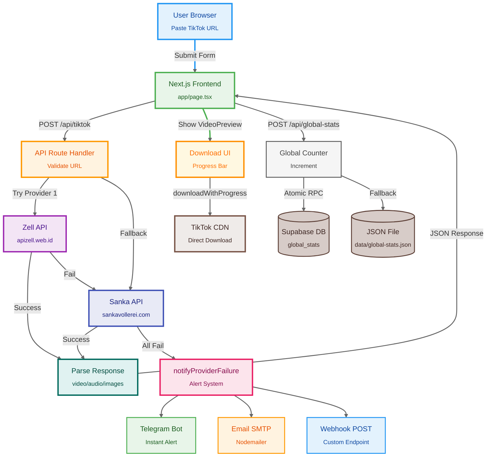
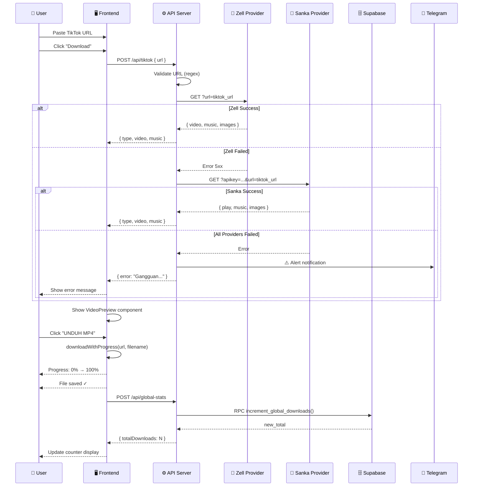
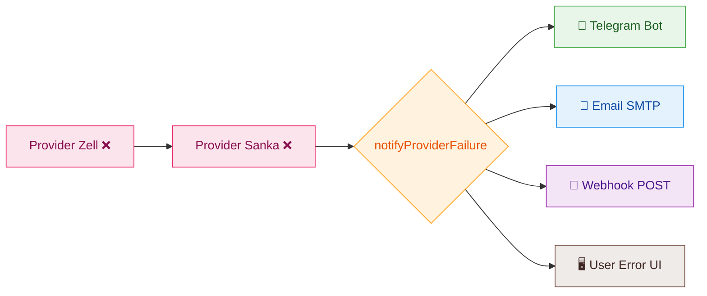

<div align="center">

<!-- Wave Header -->


<br/>

_⚡ FusionTik_

**Modern TikTok Downloader — Video · Photo Mode · MP3**

<p align="center">
  <a href="https://nextjs.org/">
    
  </a>
  <a href="https://www.typescriptlang.org/">
    
  </a>
  <a href="https://tailwindcss.com/">
    
  </a>
  <a href="https://supabase.com/">
    
  </a>
  <a href="https://vercel.com/">
    
  </a>
  <a href="./LICENSE">
    
  </a>
</p>

<p align="center">
  <a href="https://fusiontik.vercel.app">
    
  </a>
  <a href="https://github.com/jundy779/FusionTik/stargazers">
    
  </a>
  <a href="https://github.com/jundy779/FusionTik/issues">
    
  </a>
</p>

<!-- Divider -->


</div>

_🌸 Overview_

**FusionTik** adalah web application modern untuk mendownload konten TikTok tanpa watermark. Dibangun dengan **Next.js 15 App Router**, **TypeScript**, dan **Tailwind CSS** — FusionTik menawarkan pengalaman download yang cepat, bersih, dan responsif di semua perangkat.

Tidak perlu install aplikasi. Tidak perlu login. Cukup **paste link TikTok**, klik **Download**, dan simpan konten ke perangkatmu.

Built on Next.js • Powered by Supabase • Written in TypeScript

<!-- Divider -->


_🏗️ Architecture Overview_



<!-- Divider -->


_✨ Key Features_

<table>
<tr>
<td align="center" width="33%">

**🎬 Video Tanpa Watermark**


Download video TikTok
<br>dalam format MP4
<br>tanpa logo watermark

</td>
<td align="center" width="33%">

**🖼️ Photo Mode**


Simpan semua gambar
<br>dari TikTok carousel
<br>sekaligus dalam sekali klik

</td>
<td align="center" width="33%">

**🎵 Audio Extraction**


Ekstrak dan download
<br>hanya audio/musik
<br>dalam format MP3

</td>
</tr>
<tr>
<td align="center" width="33%">

**📊 Download Progress**


Progress bar real-time
<br>saat proses download
<br>berlangsung

</td>
<td align="center" width="33%">

**🕐 Download History**


Riwayat download
<br>tersimpan lokal
<br>di perangkatmu (max 100)

</td>
<td align="center" width="33%">

**🌍 Global Counter**


Counter total download
<br>seluruh pengguna
<br>di seluruh dunia

</td>
</tr>
<tr>
<td align="center" width="33%">

**🔔 Error Alerts**


Notifikasi otomatis
<br>via Telegram & Email
<br>jika provider API gagal

</td>
<td align="center" width="33%">

**🌙 Dark Mode**


Tema gelap dan terang
<br>yang bisa disesuaikan
<br>dengan preferensimu

</td>
<td align="center" width="33%">

**🔒 Privacy First**


Tidak ada file tersimpan
<br>di server — history
<br>hanya di device kamu

</td>
</tr>
</table>

<!-- Divider -->


_🔄 Message Flow_



<!-- Divider -->


_🗂️ Project Structure_

```
FusionTik/
│
├── 📁 app/                          # Next.js App Router
│   ├── 📄 layout.tsx                # Root layout + SEO metadata + PWA
│   ├── 📄 page.tsx                  # ⭐ Halaman utama downloader
│   ├── 📄 globals.css               # Global styles + custom animations
│   ├── 📄 robots.ts                 # SEO robots.txt
│   ├── 📄 sitemap.ts                # SEO sitemap.xml
│   │
│   ├── 📁 api/
│   │   ├── 📁 tiktok/
│   │   │   └── 📄 route.ts          # ⭐ Core API: fetch + fallback + alerts
│   │   └── 📁 global-stats/
│   │       └── 📄 route.ts          # Global download counter
│   │
│   ├── 📁 faq/                      # Halaman FAQ
│   ├── 📁 feedback/                 # Halaman Feedback
│   ├── 📁 help-center/              # Halaman Help Center
│   ├── 📁 privacy/                  # Privacy Policy
│   └── 📁 terms/                    # Terms of Service
│
├── 📁 components/
│   ├── 📄 navbar.tsx                # Navigation bar + dark mode toggle
│   ├── 📄 video-preview.tsx         # ⭐ Preview + download buttons
│   ├── 📄 result-card.tsx           # History item card
│   ├── 📄 result-buttons.tsx        # Download action buttons
│   ├── 📄 stats-card.tsx            # Personal statistics card
│   ├── 📄 video-preview-modal.tsx   # Modal preview
│   ├── 📄 mode-toggle.tsx           # Dark/light mode toggle
│   ├── 📄 theme-provider.tsx        # Theme context provider
│   └── 📁 ui/                       # shadcn/ui (50+ komponen)
│
├── 📁 hooks/
│   ├── 📄 use-download-history.ts   # ⭐ History (localStorage, max 100)
│   ├── 📄 use-download-stats.ts     # Personal download statistics
│   ├── 📄 use-global-stats.ts       # Global counter state
│   └── 📄 use-toast.ts              # Toast notification hook
│
├── 📁 lib/
│   ├── 📄 download-utils.ts         # ⭐ Download dengan progress tracking
│   ├── 📄 supabase.ts               # Supabase client (nullable)
│   └── 📄 utils.ts                  # Tailwind merge utilities
│
├── 📁 data/
│   └── 📄 global-stats.json         # Fallback counter (development)
│
├── 📁 public/                       # Static assets + PWA manifest
├── 📄 next.config.mjs               # Next.js config + CSP headers
├── 📄 tailwind.config.ts            # Tailwind configuration
├── 📄 tsconfig.json                 # TypeScript configuration
└── 📄 env.example                   # Template environment variables
```

<!-- Divider -->


_🛠️ Tech Stack_

<table>
<tr>
<td align="center" width="25%">

**Framework**


</td>
<td align="center" width="25%">

**Language**


</td>
<td align="center" width="25%">

**Styling**


</td>
<td align="center" width="25%">

**Database**


</td>
</tr>
</table>

<p align="left">
  
  
  
  
  
  
  
  
</p>

| Layer | Teknologi | Versi | Fungsi |
|-------|-----------|-------|--------|
| **Framework** | Next.js | 15 | App Router, SSR, API Routes |
| **Language** | TypeScript | 5 | Type safety end-to-end |
| **Styling** | Tailwind CSS | 3 | Utility-first CSS |
| **UI Components** | shadcn/ui | latest | 50+ komponen siap pakai |
| **Animation** | Framer Motion | latest | Animasi halus & interaktif |
| **Database** | Supabase | 2.x | Global download counter |
| **Email** | Nodemailer | 6.x | Alert notifikasi via SMTP |
| **Deployment** | Vercel | — | Hosting + Edge Functions |

<!-- Divider -->


_⚡ Quick Start_

### Prasyarat

- **Node.js 18+**
- **npm / pnpm / yarn**
- Akun **Supabase** (opsional, untuk global stats)

### 1. Clone & Install

```bash
git clone https://github.com/jundy779/FusionTik.git
cd FusionTik
npm install
```

### 2. Setup Environment

```bash
cp env.example .env.local
```

Edit `.env.local`:

```env
# Supabase (untuk global stats — opsional)
NEXT_PUBLIC_SUPABASE_URL=https://<your-project-ref>.supabase.co
NEXT_PUBLIC_SUPABASE_ANON_KEY=<your-supabase-anon-key>

# Notifikasi error (semua opsional)
TELEGRAM_BOT_TOKEN=
TELEGRAM_CHAT_ID=
SMTP_HOST=smtp.gmail.com
SMTP_PORT=587
SMTP_USER=youremail@gmail.com
SMTP_PASS=your-app-password
ALERT_EMAIL_TO=owner@domain.com
```

### 3. Jalankan Development Server

```bash
npm run dev
```

Buka [http://localhost:3000](http://localhost:3000) di browser.

### 4. Build Production

```bash
npm run build
npm run start

# Custom port
PORT=8080 npm run start
```

<!-- Divider -->


_⚙️ Environment Variables_

| Variable | Wajib | Deskripsi |
|----------|:-----:|-----------|
| `NEXT_PUBLIC_SUPABASE_URL` | ❌ | URL project Supabase untuk global stats |
| `NEXT_PUBLIC_SUPABASE_ANON_KEY` | ❌ | Anon key Supabase |
| `ZELL_TIKTOK_API_URL` | ❌ | Override URL provider Zell |
| `SANKA_TIKTOK_API_URL` | ❌ | Override URL provider Sanka |
| `SANKA_TIKTOK_API_KEY` | ❌ | API key untuk provider Sanka |
| `ALERT_WEBHOOK_URL` | ❌ | Webhook URL untuk notifikasi error |
| `TELEGRAM_BOT_TOKEN` | ❌ | Token bot Telegram untuk alert |
| `TELEGRAM_CHAT_ID` | ❌ | Chat ID penerima notifikasi Telegram |
| `SMTP_HOST` | ❌ | SMTP host untuk email alert |
| `SMTP_PORT` | ❌ | SMTP port (587 TLS / 465 SSL) |
| `SMTP_USER` | ❌ | Email pengirim |
| `SMTP_PASS` | ❌ | Password / App Password email |
| `ALERT_EMAIL_TO` | ❌ | Email penerima alert |

> **Catatan:** Jika Supabase tidak dikonfigurasi, global stats menggunakan `data/global-stats.json` sebagai fallback (cocok untuk development).

<!-- Divider -->


_🌐 Deployment_

### Deploy ke Vercel (Recommended)

1. Fork repo ini ke akun GitHub kamu
2. Buka [vercel.com/import](https://vercel.com/import) dan pilih repo **FusionTik**
3. Set environment variables di dashboard Vercel
4. Klik **Deploy** — Vercel akan build dan host otomatis

### Deploy ke VPS / Server Sendiri

```bash
git clone https://github.com/jundy779/FusionTik.git
cd FusionTik
npm install
cp env.example .env.local
# Edit .env.local sesuai kebutuhan
npm run build
npm run start
```

**Gunakan PM2 untuk production:**

```bash
npm install -g pm2
pm2 start "npm run start" --name fusiontik
pm2 save && pm2 startup
```

<!-- Divider -->


_🗄️ Setup Supabase_

Untuk mengaktifkan global download counter yang persisten:

**1. Buat Tabel**

```sql
CREATE TABLE global_stats (
  id BIGINT PRIMARY KEY DEFAULT 1,
  total_downloads BIGINT DEFAULT 0,
  updated_at TIMESTAMPTZ DEFAULT NOW()
);

INSERT INTO global_stats (id, total_downloads) VALUES (1, 0);
```

**2. Buat RPC Function (Atomic Increment)**

```sql
CREATE OR REPLACE FUNCTION increment_global_downloads()
RETURNS BIGINT LANGUAGE plpgsql AS $$
DECLARE new_total BIGINT;
BEGIN
  UPDATE global_stats
  SET total_downloads = total_downloads + 1, updated_at = NOW()
  WHERE id = 1
  RETURNING total_downloads INTO new_total;
  RETURN new_total;
END;
$$;
```

**3. Row Level Security**

```sql
ALTER TABLE global_stats ENABLE ROW LEVEL SECURITY;
CREATE POLICY "Allow public read" ON global_stats FOR SELECT USING (true);
CREATE POLICY "Allow public update" ON global_stats FOR UPDATE USING (true);
```

<!-- Divider -->


_🔔 Sistem Notifikasi Error_

Ketika **semua provider API gagal**, FusionTik otomatis mengirim alert:



**Contoh pesan Telegram yang dikirim:**
```
⚠️ FusionTik downloader error
URL: https://www.tiktok.com/@user/video/123
Error: Zell API returned 503: Service Unavailable
Time: 2025-01-15T10:30:00.000Z
```

<!-- Divider -->


_📊 Statistik & Analytics_

### Global Stats
Disimpan di **Supabase** dengan atomic increment via RPC. Fallback ke **file JSON** untuk development. Ditampilkan di hero section halaman utama.

### Personal Stats (Per User)
Disimpan di **localStorage** browser:

| Metrik | Deskripsi |
|--------|-----------|
| 📥 Total Downloads | Jumlah total konten yang didownload |
| 🎬 Videos Downloaded | Jumlah video yang didownload |
| 🖼️ Images Downloaded | Jumlah foto/carousel yang didownload |
| 🎵 Audio Extracted | Jumlah audio yang diekstrak |
| 📅 Today Downloads | Download hari ini |
| 📆 This Week | Download 7 hari terakhir |
| 🗓️ This Month | Download 30 hari terakhir |
| 🏆 Most Active Day | Hari dengan download terbanyak |
| 📈 Average/Day | Rata-rata download per hari |

<!-- Divider -->


_🔒 Keamanan & Privasi_

- ✅ **Tidak ada file tersimpan di server** — semua konten langsung dari CDN TikTok
- ✅ **History hanya di device pengguna** — tidak ada tracking server-side
- ✅ **CSP Headers** — Content Security Policy ketat di semua response
- ✅ **Security Headers** — HSTS, X-Frame-Options, X-Content-Type-Options, dll
- ✅ **XSS Protection** — Caption TikTok di-escape sebelum render HTML
- ✅ **No Third-party Tracking** — Tidak ada Google Analytics atau tracker pihak ketiga

<!-- Divider -->


_📝 Changelog_

### v2.1.0 — Clean Code & Security Update
- ✅ **Refactor**: hapus semua `any` type → proper TypeScript interfaces
- ✅ **Security**: XSS fix pada caption rendering (HTML entity escaping)
- ✅ **Fix**: atomic Supabase counter increment via RPC
- ✅ **Fix**: sequential image download (cegah browser popup blocking)
- ✅ **Improvement**: `response.ok` check pada semua fetch calls
- ✅ **Improvement**: history limit 100 item + `useRef` fix untuk infinite loop
- ✅ **Improvement**: konsistensi `downloadWithProgress` di semua download handler
- ✅ **Security**: hapus exposed Supabase key dari `env.example`

### v2.0.0 — Multi-Provider & Alerts
- ✅ Dual provider dengan fallback (Zell → Sanka)
- ✅ Notifikasi error multi-channel (Webhook + Telegram + Email)
- ✅ Global download counter dengan Supabase
- ✅ Download progress tracking dengan ReadableStream
- ✅ Personal download statistics
- ✅ Dark/Light mode

<!-- Divider -->


_🤝 Contributing_

<div align="center">

**Contributions are welcome!** 💖

</div>

1. **Fork** repo ini
2. Buat **branch baru**: `git checkout -b feature/nama-fitur`
3. **Commit** perubahan: `git commit -m "feat: tambah fitur X"`
4. **Push** ke branch: `git push origin feature/nama-fitur`
5. Buka **Pull Request** ke branch `main`

**Konvensi Commit:**

| Prefix | Deskripsi |
|--------|-----------|
| `feat:` | Fitur baru |
| `fix:` | Bug fix |
| `refactor:` | Refactoring kode |
| `docs:` | Update dokumentasi |
| `style:` | Perubahan styling |
| `chore:` | Maintenance / dependency update |

<!-- Divider -->


_⚖️ Legal & Disclaimer_

> [!WARNING]
> **Gunakan dengan bijak:**
> - Layanan ini untuk penggunaan **pribadi** saja
> - Hormati hak cipta kreator konten
> - Jangan gunakan konten yang didownload untuk tujuan komersial tanpa izin
> - Ikuti [Terms of Service TikTok](https://www.tiktok.com/legal/page/global/terms-of-service/en)
> - FusionTik **tidak berafiliasi** dengan TikTok atau ByteDance Ltd.

<!-- Divider -->


_💖 Acknowledgements_

**Core Technologies**

<p align="left">
  
  
  
  
  
  
  
  
</p>

**Community & Contributors**

- 💚 Semua [contributors](https://github.com/jundy779/FusionTik/graphs/contributors) yang membuat ini mungkin
- 🌍 Komunitas open-source yang luar biasa
- ⭐ Semua yang sudah memberikan bintang di repo ini

<!-- Divider -->


<div align="center">

<!-- Star History -->
<p><strong>🌟 Star History</strong></p>
<a href="https://star-history.com/#jundy779/FusionTik&Date">
  
</a>

<hr/>

<p><strong>Maintained with ❤️ by <a href="https://linktr.ee/fusionifytempest">FUSIONIFY DIGITAL.ID</a></strong></p>

<br/>


</div>
